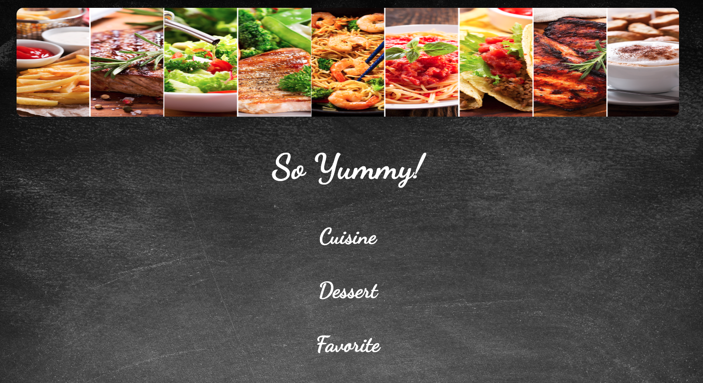
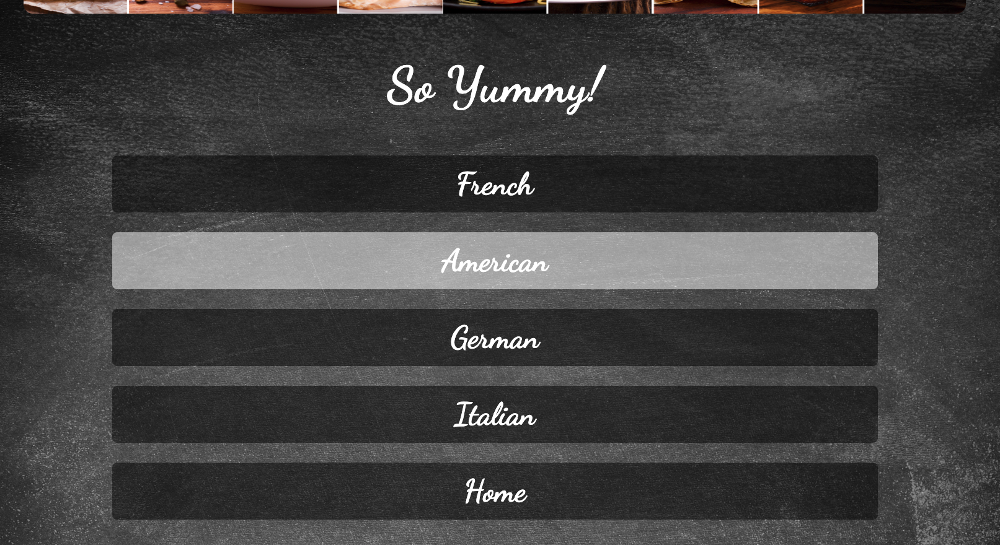
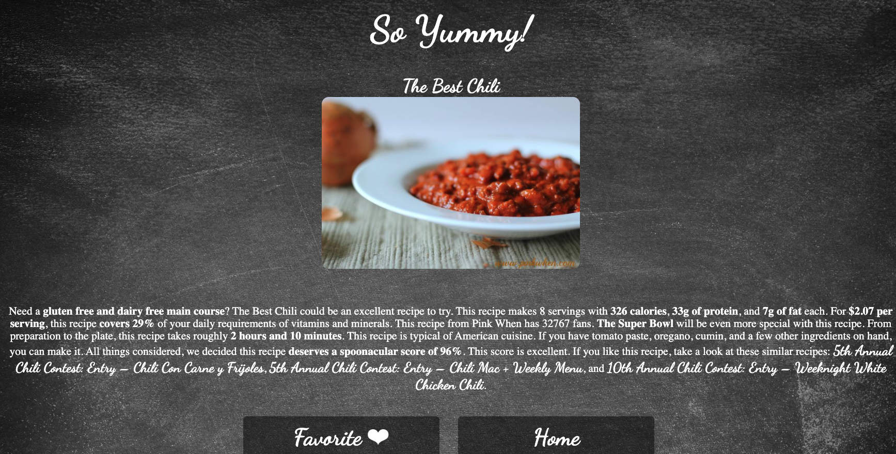
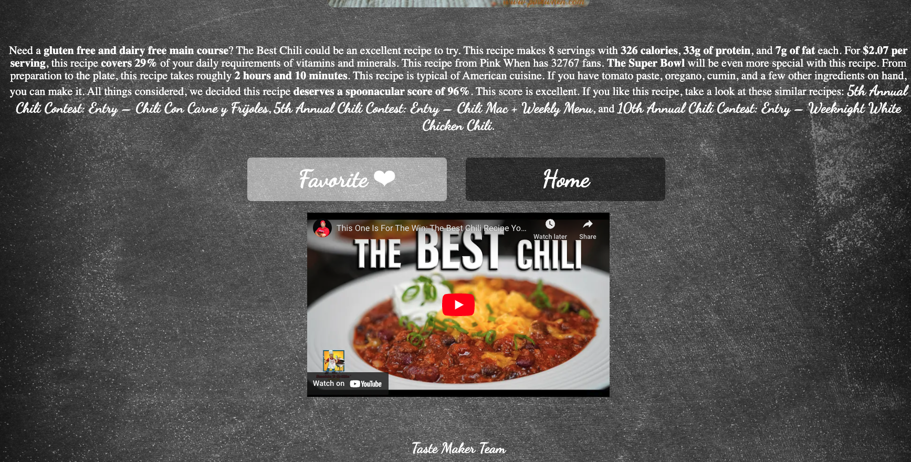
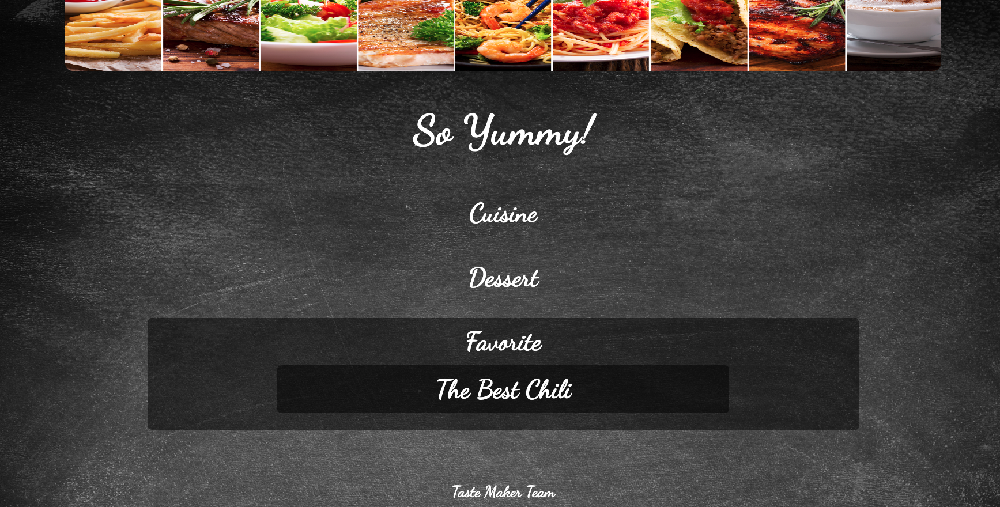

# Taste_Makers
  I created this recipe finder app with a team of web developers learning in the UT Austin Full Stack Coding Bootcamp.

## Motivation

- This project helped me understand fetching information from a third-party API.
- This project also taught me how to use local storage.

## Description

  Users can choose between four options for cuisine and desert, view a list of recipes, and a video tutorial, and then save their favorite recipes to favorites.

## Usage
Visit our [Tastemakers website](https://ericaemorabito.github.io/Taste_Makers/).

Choose between four cuisine styles: French, American, German, and Italian.

Each style containes 10 different recipes.

Choose a recipe and view the instructions and video tutorial.

Click "Favorite" to save the recipe to your homepage.

When favorite button clicked, recipe will be saved to homepage

## Deployed Application
https://ericaemorabito.github.io/Taste_Makers/

## API
* Spoonacular: https://spoonacular.com/food-api
* Youtube: https://developers.google.com/youtube/v3

## Credits
Completed with my wonderful team: Emma Vasquez, Alexandria Guerrero, Danie McCormick, Sheldan and Adam Gonterman from UT Austin Bootcamp.
